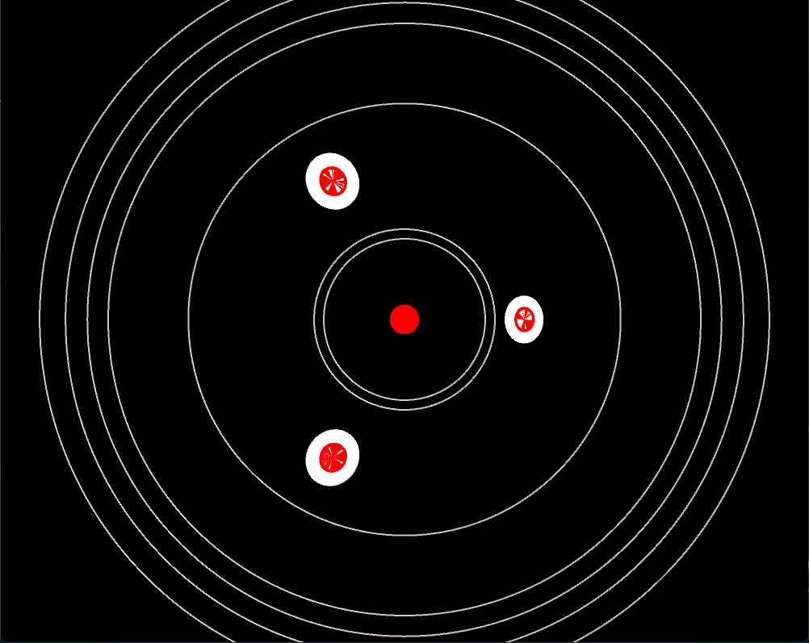
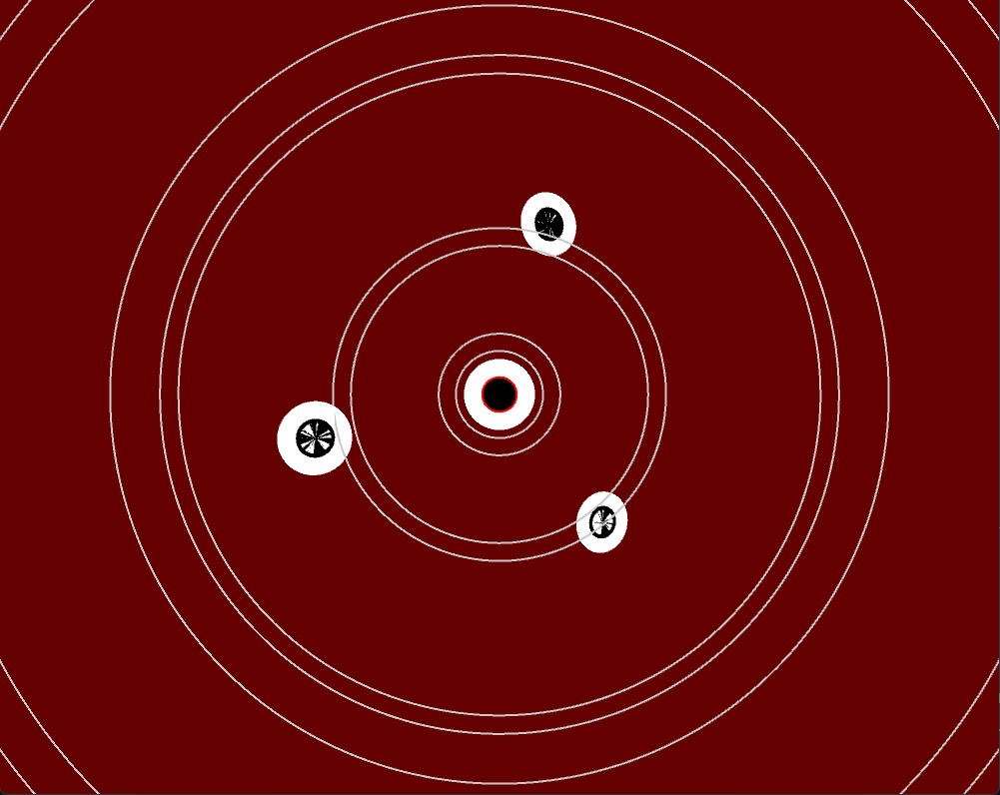
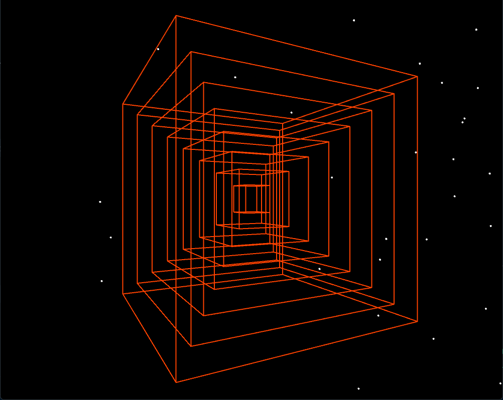
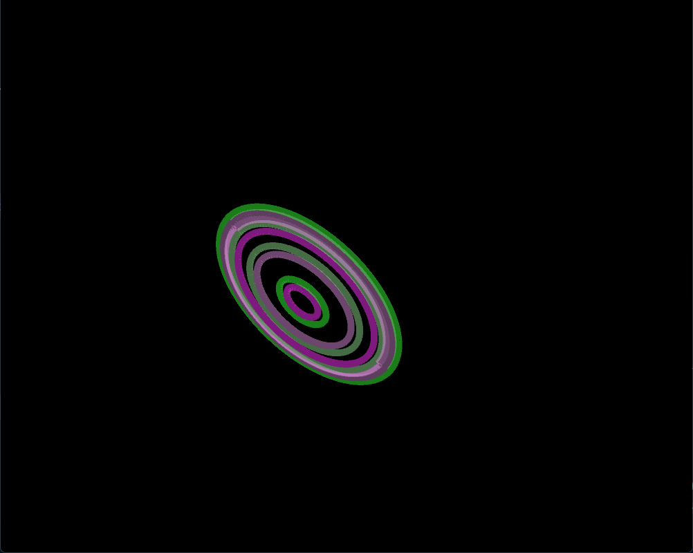

# Music Visualiser Project

Student Number: C21416022 (Bakht Zia Khan), C21716601 (Emil Roy), C21388736 (Nicolas Ruth)


# Description of the assignment
Assignment Brief: In this creative coding team project, you will work in a team of up to four, to create an abstract visual story of a song. You will use Processing, Minim or the Processing Sound library to create audio responsive elements and Github to manage your project. You will create a program that responds to the audio of a chosen song and generates a visually compelling and abstract representation of the song's mood, tempo, and structure. The program should showcase your teamwork, creativity, technical skills, and ability to effectively communicate emotions and narrative through visual elements.


# Instructions
Press F5 to see the Music Visual.
Press Space to start the Visual and press the numbers 1 to 5 to change visuals.


# How it works
The Main.java file is the main file that runs everything on the program. When you press F5 to run the code, main calls on rockstar.java. The file rockstar.java calls on all the visuals, and allows the user to flick through them using the keys 1-5. The way this works is that the other classes use inheritance to call on the super/parent class. To do this the word extends is used. 

In the setup method, objects are created in rockstar.java.

```Java
public void setup()
    {
        startMinim();

        loadAudio("immortal.mp3");

        er = new emil(this);
        er1 = new emil1(this);
        bakht = new bakht(this);
        nico = new nico(this);
        us = new us(this);
        us1 = new us1(this);
        visual6 = new visual6(this);


        colorMode(RGB);
    }
```

Then finally in the draw method, the variable and the method used to created the shapes are called and to this I used a switch statement:

```Java
public void draw()
    {
        background(0);
        try
        {
            // Call this if you want to use FFT data
            calculateFFT(); 
        }
        catch(VisualException e)
        {
            e.printStackTrace();
        } 
        // Call this is you want to use frequency bands
        calculateFrequencyBands(); 

        // Call this is you want to get the average amplitude
        calculateAverageAmplitude();

        switch(v)
        {
            case 1:
            {
                bakht.render();
                break;
            }

            case 2:
            {

                er.render();
                er1.render();

                break;
            }

            case 3:
            {
                
                nico.render();
                break;
            }

            case 4:
            {

                visual6.render();

                break;
            }

            case 5:
            {

                us1.render();
                us.render();

                break;
            }


        }
    }
```

# What We am most proud of in the assignment
What we are most proud of is how we were able to work as a group and develop cool visualisations. We are especially proud of case 5


This is code:

```Java
public void render()
{
	ui.noFill();
	ui.stroke(255);
	ui.rect(x, y, width, height);
	ui.textAlign(PApplet.CENTER, PApplet.CENTER);
	ui.text(text, x + width * 0.5f, y + height * 0.5f);
}
```


# Images
Case 1:


Case 2:


Case 3:

Case 4:

Case 5:


# Youtube Video:

[](https://www.youtube.com/watch?v=J2kHSSFA4NU)

